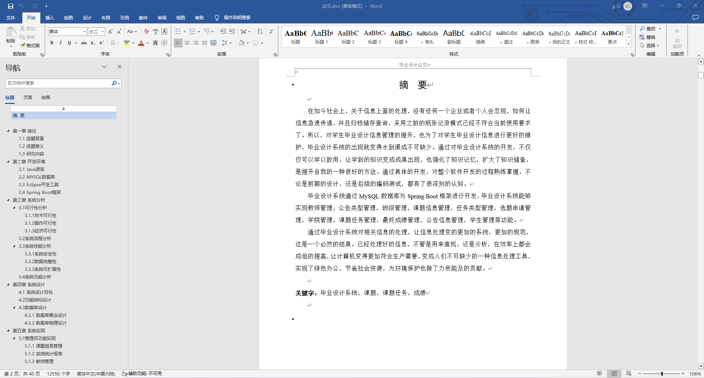
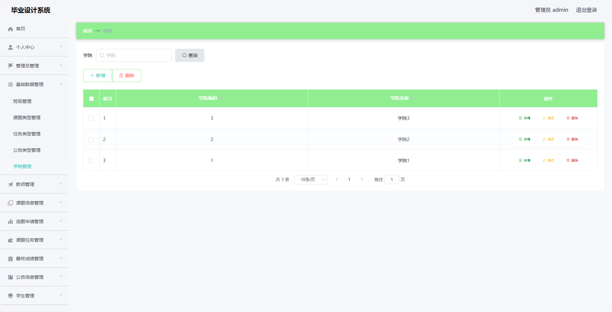
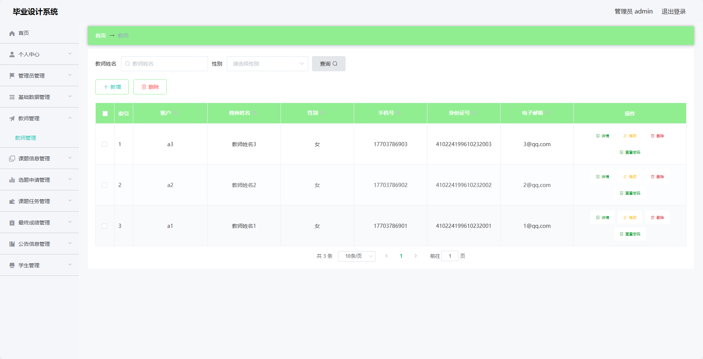
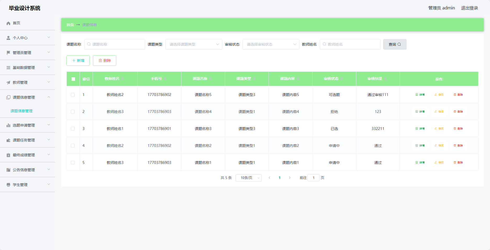
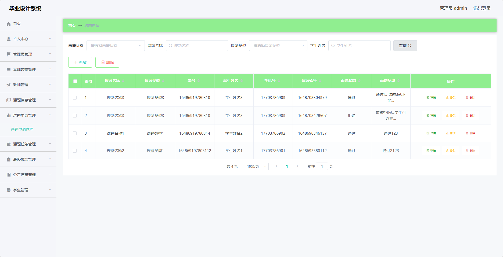
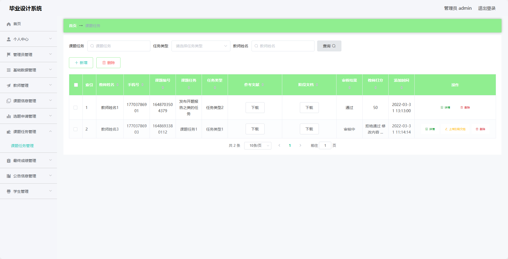
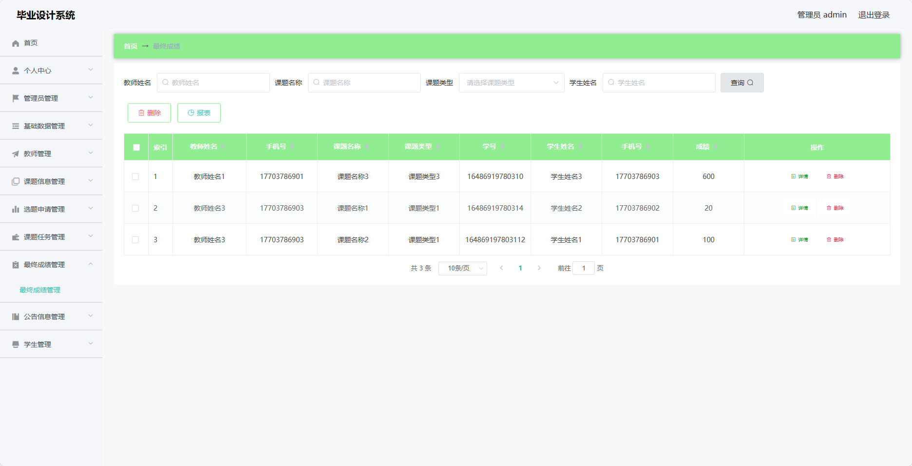
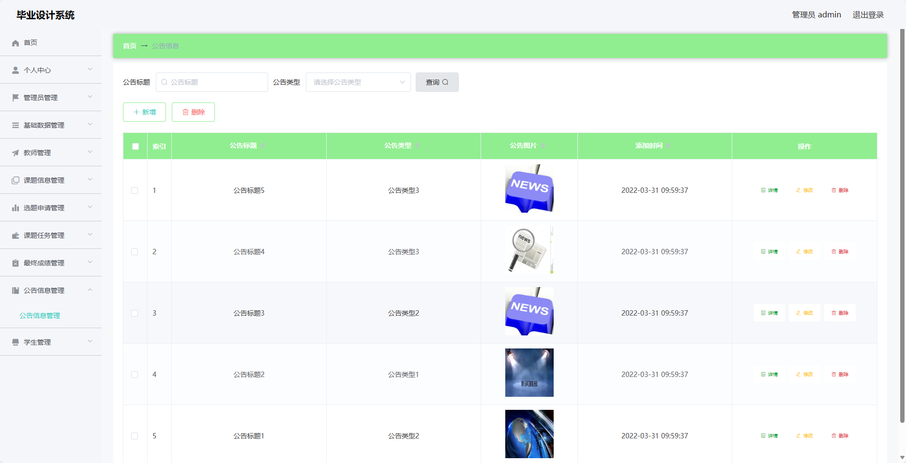
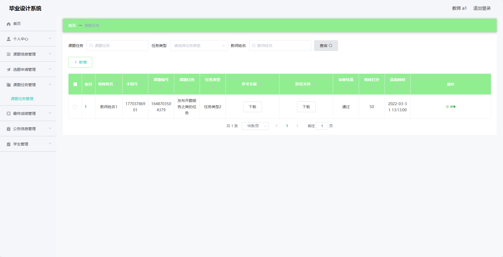

## 基于SpringBoot的毕业设计系统(程序+报告)

###  获取sql数据库文件: 从戎源码网 (https://armycodes.com/) QQ: 386869957 QQ群: 377586148
###  所有系统地址: (https://github.com/YuLin-Coder/AllProjectCatalog) 
###  所有项目以及源代码本人均调试运行无问题 可支持远程安装部署调试、定制修改、代码讲解

## 项目介绍
基于SpringBoot的毕业设计系统，系统包含两种角色：管理员、教师、学生,系统分为前台和后台两大模块，主要功能如下。

### 【管理员】:
- 个人中心：管理个人信息。
- 管理员管理：管理系统中的管理员账号信息，包括添加、编辑、删除管理员等操作。
- 基础数据管理：管理系统中的基础数据，包括课程分类、学院信息等。
- 教师管理：管理系统中的教师信息，包括添加、编辑、删除教师等操作。
- 课题信息管理：管理系统中的课题信息，包括添加、编辑、删除课题等操作。
- 选题申请管理：管理学生的选题申请，包括审批选题申请等操作。
- 课题任务管理：管理课题的任务信息，包括添加、编辑、删除任务等操作。
- 最终成绩管理：管理学生的最终成绩，包括录入、修改成绩等操作。
- 公告信息管理：管理系统中的公告信息，包括发布、编辑、删除公告等操作。
- 学生管理：管理系统中的学生信息，包括添加、编辑、删除学生等操作。

### 教师：
- 个人中心：管理个人信息。
- 课题信息管理：管理教师发布的课题信息，包括添加、编辑、删除课题等操作。
- 选题申请管理：管理学生的选题申请。
- 课题任务管理：管理课题的任务信息，包括添加、编辑、删除任务等操作。
- 最终成绩管理：管理学生的最终成绩，包括录入、修改成绩等操作。
- 公告信息管理：管理系统中的公告信息，包括发布、编辑、删除公告等操作。
- 学生管理：管理教师负责的学生信息。

### 学生：
- 个人中心：管理个人信息。
- 课题信息管理：浏览系统中的课题信息。
- 选题申请管理：申请选择课题。
- 课题任务管理：查看课题任务信息。
- 最终成绩管理：查看个人的最终成绩。
- 公告信息：查看系统中的公告信息。

## 项目技术
- 编程语言：Java
- 数据库：MySQL
- 项目管理工具：Maven
- 前端技术：HTML、CSS、JavaScript、Jquery、Vue
- 后端技术：Spring、SpringMVC、MyBatis

## 运行环境
- JDK版本：JDK1.8及以上
- 开发工具：IDEA、Ecplise、Myecplise都可以
- 数据库: MySQL5.7及以上
- Maven：maven3.0及以上
- Node：14.14.0及以上

## 运行截图

